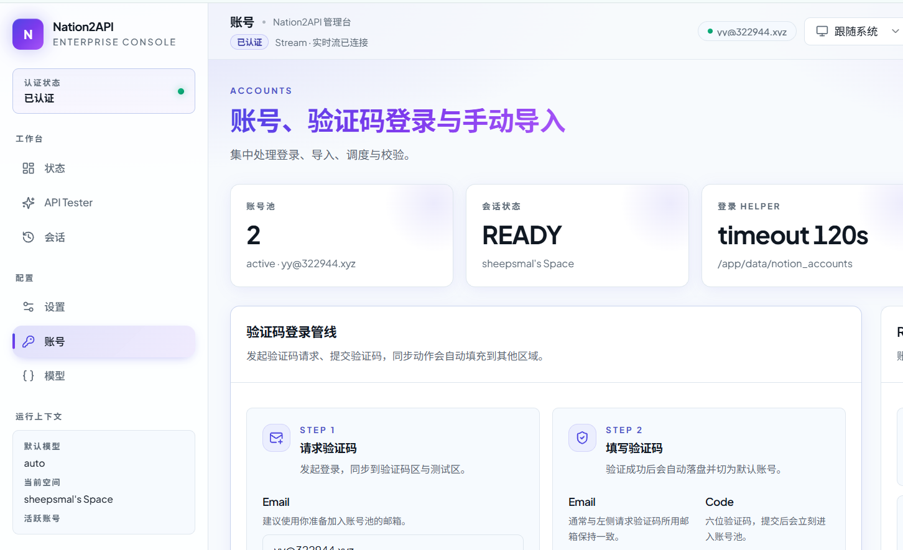
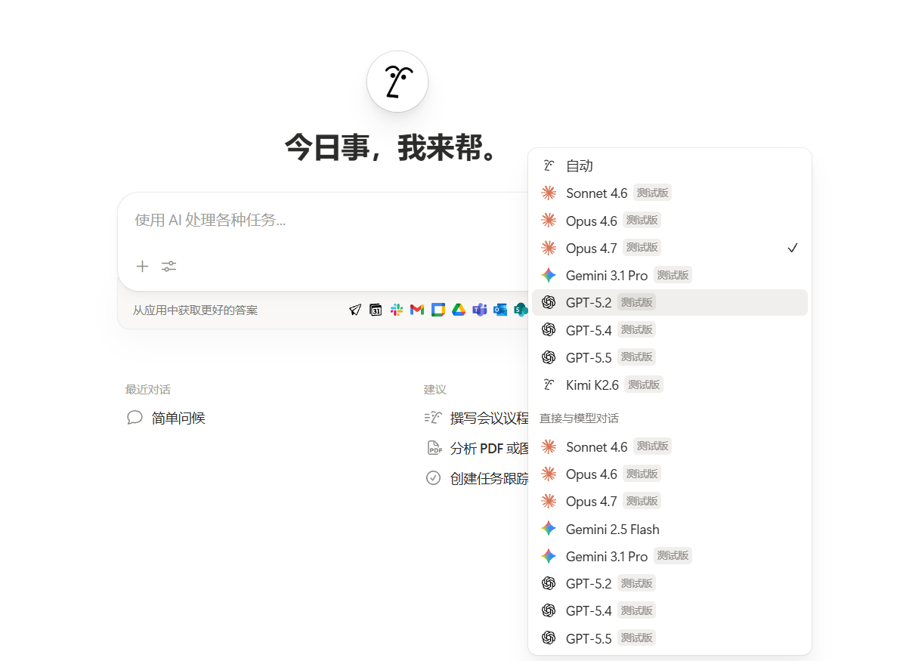
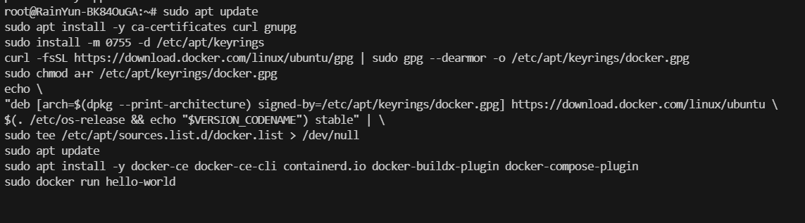
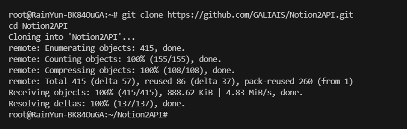
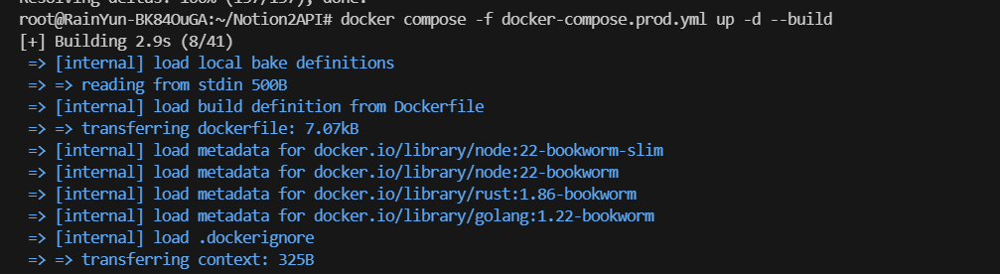
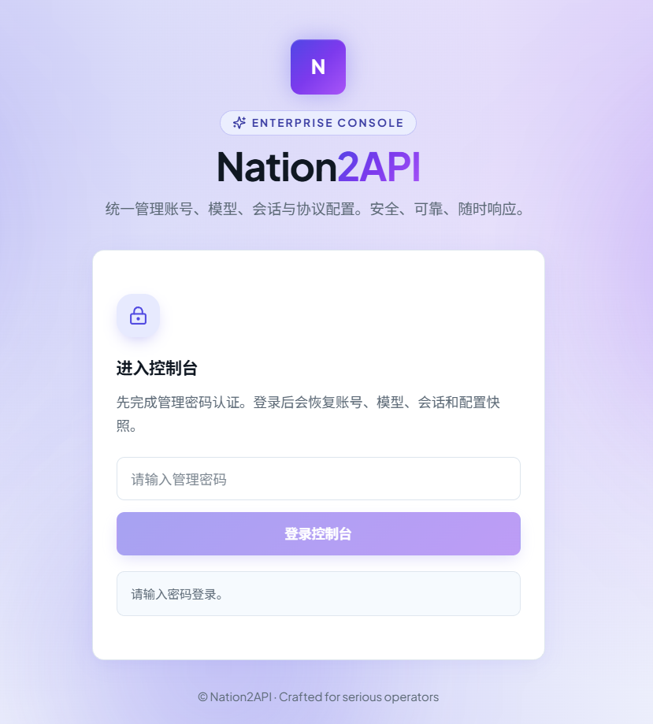
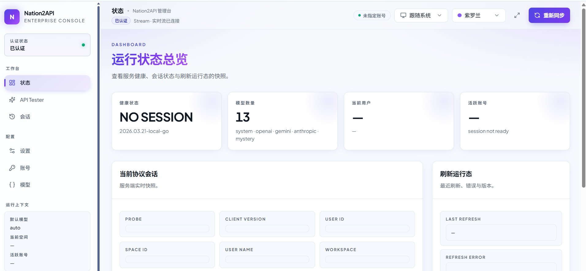
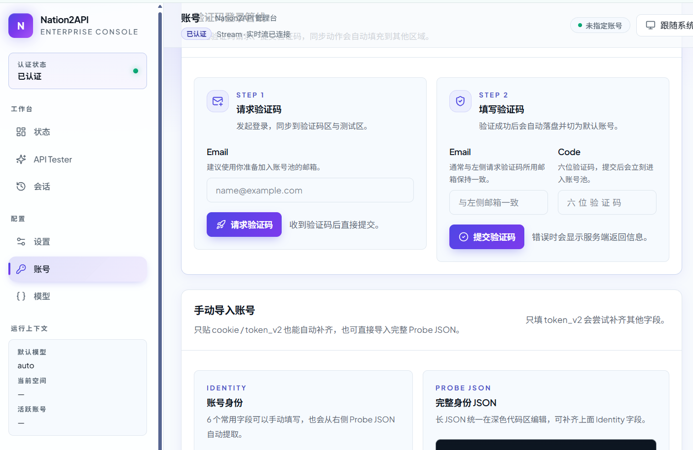
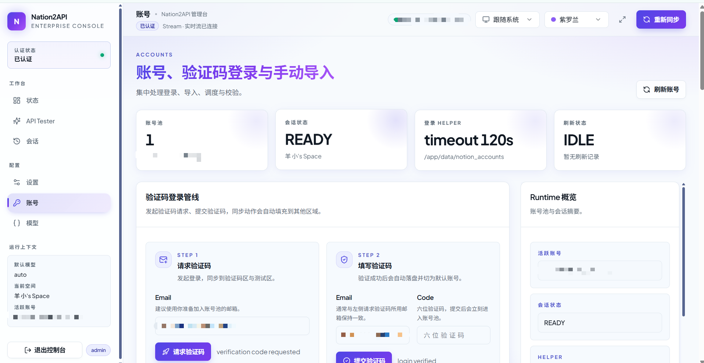
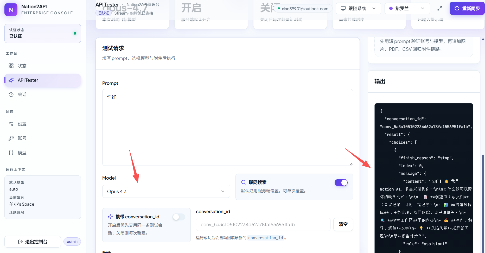

# 🧠 Notion2API

基于 Notion AI 提供 OpenAI 兼容 API，有多账号池和管理 UI。



Notion AI 非常丰富，包括 **Opus 4.7**，**Gemini 3.1 Pro**，**GPT-5.5** 等等顶级 AI，如果有教育邮箱额度会更高一个层次？（不确定，但官方从未说过教育版会提高 AI 额度）



项目地址：https://github.com/GALIAIS/Notion2API

推荐服务器部署，不要选择国内地区，选择 Linux 版本 Docker 上手快。

腾讯云新加坡，硅谷，东京地区价格是199元一年，2核4G30M带宽，60GBSSD盘 1.5T月流量，推荐首尔地区↓↓↓，系统选Ubuntu24，可以同样价格续费。

购买地址：https://curl.qcloud.com/oyWDLkRJ


## 教程

### 1. Ubuntu24系统安装Docker

```
sudo apt update
sudo apt install -y ca-certificates curl gnupg
sudo install -m 0755 -d /etc/apt/keyrings
curl -fsSL https://download.docker.com/linux/ubuntu/gpg | sudo gpg --dearmor -o /etc/apt/keyrings/docker.gpg
sudo chmod a+r /etc/apt/keyrings/docker.gpg
echo \
"deb [arch=$(dpkg --print-architecture) signed-by=/etc/apt/keyrings/docker.gpg] https://download.docker.com/linux/ubuntu \
$(. /etc/os-release && echo "$VERSION_CODENAME") stable" | \
sudo tee /etc/apt/sources.list.d/docker.list > /dev/null
sudo apt update
sudo apt install -y docker-ce docker-ce-cli containerd.io docker-buildx-plugin docker-compose-plugin
sudo docker run hello-world
```




### 2. 下载项目

```
sudo git clone https://github.com/GALIAIS/Notion2API.git
cd Notion2API
```



### 3. 部署

```
sudo docker compose up -d
```



### 4. 浏览器访问

```
http://你的服务器ip:8787
```

记得腾讯云安全组里面放通防火墙端口8787



### 5. 输入默认密码

```
change-me-admin-password
```



### 6. 找到账号，请求验证码登录



### 7. 账号成功登录



### 8. 测试 API

项目里面有测试，简单测试一下 Opus 4.7，成功回复。



## 接口信息

接口：http://127.0.0.1:8787/v1/

模型：Opus 4.7，Gemini 3.1 Pro，GPT-5.5

密钥：change-me-openai-key

## 修改密钥后重启

修改密钥后记得重启，命令

```
docker compose down && docker compose up -d
```
